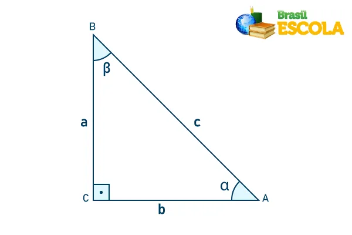

# Trigonometria-EMA3P3

## Atividade A3 - Parte Final

Faça a resolução dos cálculos de seu tema de grupo utilizando as bibliotecas próprias e prontas em Python ou em outra linguagem de programação de sua escolha. Explique a função e os fundamentos dos cálculos. Implemente em python ou em outra linguagem de programação de sua escolha o cálculo sem utilizar funções prontas, implementando as principais operações do cálculo de seu tema. Crie uma interface de terminal para que o usuário possa fazer a entrada de dados com menu de opções. A entrada e manipulação de valores obrigatoriamente deve ser por variáveis, não sendo permitido cálculos estáticos do tema. Apresente em aula.
OBS: A presença dos alunos até o final de todas as apresentações é obrigatória para a obtenção de nota. A ausência ou saída antecipada das apresentações somente será justificada com apresentação de atestado médico. 
A data da apresentação será no dia 06/12/2024, conforme marcado no início do semestre.

## Informações importantes.

- A trigonometria é a área da matemática que estuda a relação entre a medida dos lados de um triângulo e seus ângulos.
- Seno, o Cosseno e a Tangente.

Note que, na imagem, a hipotenusa é o lado c.

Já os lados a e b são conhecidos como catetos, quando analisamos as posições desses lados em relação aos ângulos β e α, eles recebem nomes especiais. Quando um lado está de frente ao ângulo, ele é conhecido como cateto oposto, na imagem, o lado b é cateto oposto em relação ao ângulo β, e o lado a é oposto ao ângulo α, então, ser oposto ou não depende do ângulo que estamos estudando.
